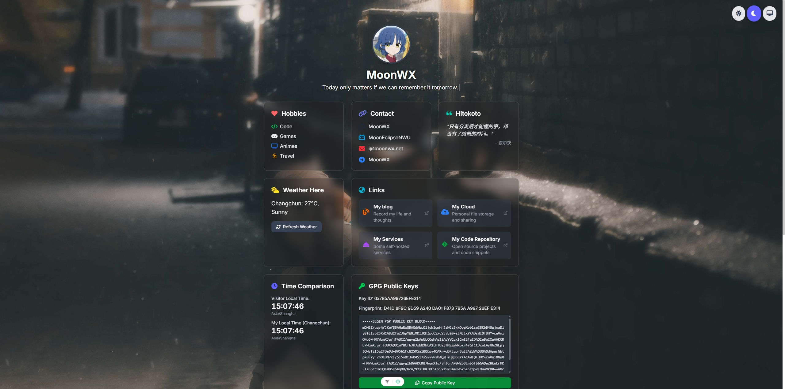
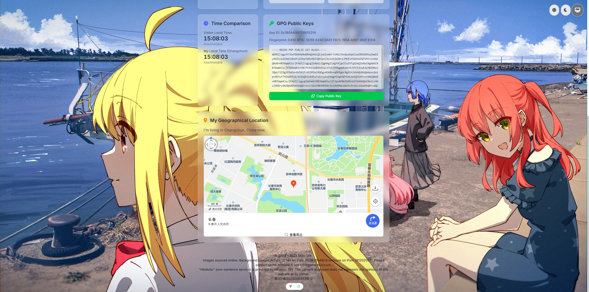

# MoonWX's HomePage

A simple homepage built with Vue 3, Vite, and Tailwind CSS.

And it's beautiful (at least to me)!

## Demo

You can view the demo of this project at [https://moonwx.net](https://moonwx.net).

## Screenshots




## Places you may want to modify

Before we start, I must clarify that this is a project mainly for my personal use, so there might be many places you may need to change to suit your needs. And there is **NO ANY WARRANTY**.

- `src/data/profileData.json`: This file contains your profile data, such as your name, avatar, and social media links. You can modify it to reflect your own information. These options are easy to understand, so I won't explain them in detail here.

- `src/views/HomePageView.vue`: This is the main view of the homepage. You just need to focus on the `<main>` section, where you can add or remove cards as you like. The sections are already styled with grid. Default column is 1, middle column is 2, and large column is 3. You can change how many columns a card occupies by modifying the `md:col-span-${n}` when the screen is mid-wide or `lg:col-span-${n}` classes when the screen is large-wide in the `<main>` section.
- If you change the background image, you may find the text color is not suitable for the new background. You can change the text color by modifying the `text-` classes. All the text colors are devided into light and dark mode, you can use global search `isDarkMode ? 'text-` to find the places where the text color is set. (I know it's shitty, please forgive me, I may improve it in the future.)

## Project Setup

```sh
npm install
```

### Compile and Hot-Reload for Development

```sh
npm run dev
```

### Compile and Minify for Production

```sh
npm run build
```

### Lint with [ESLint](https://eslint.org/)

```sh
npm run lint
```

After you compile and minify for production, you can find the output files in the `dist` directory. You can deploy this directory to any static file hosting service, such as GitHub Pages, Netlify, or Vercel.

## License

This project is licensed under the LGPL License. See the [LICENSE](LICENSE) file for details.

## Acknowledgements

Images sourced online. Background Images Artists: JLT4n on Pixiv (103933948) & evrmore on Pixiv (91202097). Please contact us for removal if any infringement occurs.

"Hitokoto" (one-sentence service) is provided by Hitokoto API. The content displayed does not represent the opinions of this website or its owner.